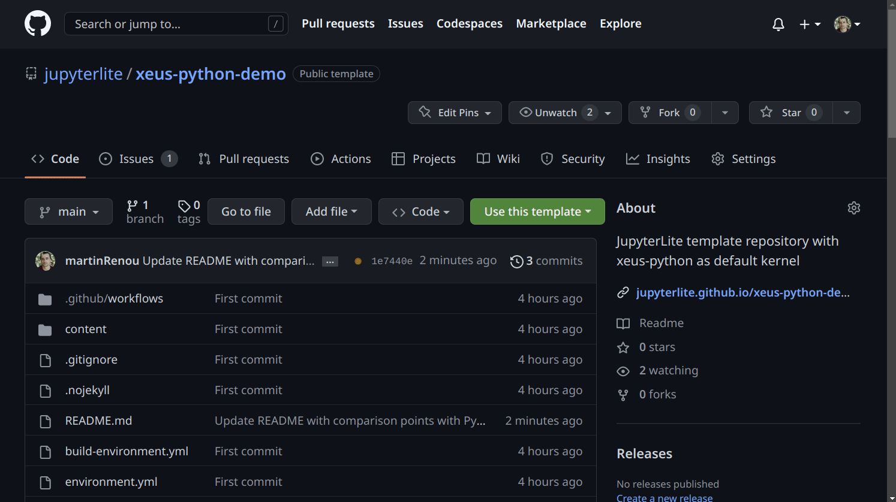
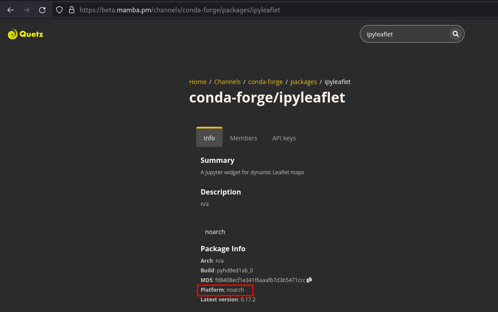

# xeus kernels + JupyterLite demo

[](https://jupyterlite.github.io/xeus-python-demo/notebooks/?path=demo.ipynb)

xeus kernels + JupyterLite deployed as a static site to GitHub Pages, for demo purposes.

## ✨ Try it in your browser ✨

https://jupyterlite.github.io/xeus-python-demo/notebooks/?path=demo.ipynb

## 💡 How to make your own deployment



Then your site will be published under https://{USERNAME}.github.io/{DEMO_REPO_NAME}

## 📦 How to install kernels and packages

You can install a specific kernels and extra packages by adding them to the ``environment.yml`` file.

For example, if you want to create a JupyterLite deployment with NumPy and Matplotlib pre-installed, you would need to edit the ``environment.yml`` file as following:

```yml
name: xeus-kernel
channels:
  - https://repo.mamba.pm/emscripten-forge
  - conda-forge
dependencies:
  - xeus-python
  - numpy
  - matplotlib
```

Instead, if you'd like to use the R kernel and the coursekata package pre-installed, you can edit the ``environment.yml`` as following:

```yml
name: xeus-kernel
channels:
  - https://repo.mamba.pm/emscripten-forge
  - conda-forge
dependencies:
  - xeus-r
  - r-coursekata
```

Only ``no-arch`` packages from ``conda-forge`` and packages from ``emscripten-forge`` can be installed.
- **How do I know if a package is ``no-arch`` on ``conda-forge``?** ``no-arch`` means that the package is OS-independent, usually pure-python packages are ``no-arch``. To check if your package is ``no-arch`` on ``conda-forge``, check if the "Platform" entry is "no-arch" in the https://beta.mamba.pm/channels/conda-forge?tab=packages page. If your package is not ``no-arch`` but is a pure Python package, then you should probably update the feedstock to turn your package into a ``no-arch`` one.

- **How do I know if my package is on ``emscripten-forge``?** You can see the list of packages pubished on ``emscripten-forge`` [here](https://beta.mamba.pm/channels/emscripten-forge?tab=packages). In case your package is missing, or it's not up-to-date, feel free to open an issue or a PR on https://github.com/emscripten-forge/recipes.

## ≠ How does xeus-python lite compare to the Pyodide kernel?

#### Pyodide kernel:

- Is based on [Pyodide](https://github.com/pyodide/pyodide)
- Provides a way to dynamically install packages with ``piplite`` (**e.g.** ``await piplite.install("ipywidgets")``)
- **Does not support** sleeping with ``from time import sleep``
- **Does not support** pre-installing packages

#### xeus-python lite:

- Is based on [xeus-python](https://github.com/jupyter-xeus/xeus-python)
- **Does not provide** a way to dynamically install packages (yet. We are working on building a ``mamba`` package manager for WASM)
- **Supports** sleeping with ``from time import sleep``
- **Supports** pre-installing packages from ``emscripten-forge`` and ``conda-forge``, by providing an ``environment.yml`` file defining the runtime environment

